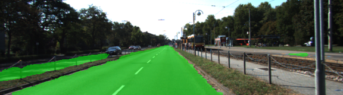
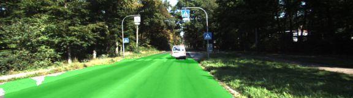
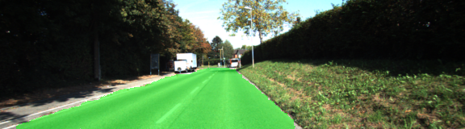
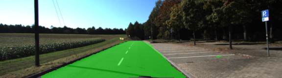
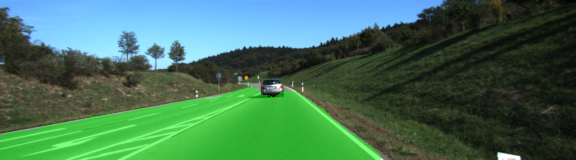
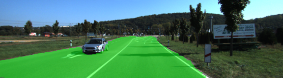
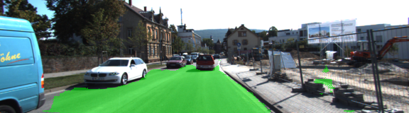

# Semantic Segmentation
### Introduction
In this project, we need to label the pixels of a road in images using a Fully Convolutional Network (FCN). We have used VGG16 and converted it into FCN. I have used FCN-8 thus by connecting the 7th layer with 4th layer and then connecting with 3rd layer.

### Setup
##### GPU
`main.py` will check to make sure you are using GPU - if you don't have a GPU on your system, you can use AWS or another cloud computing platform.
##### Frameworks and Packages
Make sure you have the following is installed:
 - [Python 3](https://www.python.org/)
 - [TensorFlow](https://www.tensorflow.org/)
 - [NumPy](http://www.numpy.org/)
 - [SciPy](https://www.scipy.org/)
##### Dataset
Download the [Kitti Road dataset](http://www.cvlibs.net/datasets/kitti/eval_road.php) from [here](http://www.cvlibs.net/download.php?file=data_road.zip).  Extract the dataset in the `data` folder.  This will create the folder `data_road` with all the training a test images.

### Hyperparameters
* Epoch: 20
* Batch Size: 5
* Keep Prob : 0.75
* Learning Rate: 0.0008

### Training and Loss
Starting Training..., Epochs: 20, batch size: 5
Epoch: 1, Avg Loss: 0.7576
Epoch: 2, Avg Loss: 0.4806
Epoch: 3, Avg Loss: 0.3421
Epoch: 4, Avg Loss: 0.2997
Epoch: 5, Avg Loss: 0.2805
Epoch: 6, Avg Loss: 0.2574
Epoch: 7, Avg Loss: 0.2428
Epoch: 8, Avg Loss: 0.2269
Epoch: 9, Avg Loss: 0.2262
Epoch: 10, Avg Loss: 0.2191
Epoch: 11, Avg Loss: 0.1963
Epoch: 12, Avg Loss: 0.1856
Epoch: 13, Avg Loss: 0.1795
Epoch: 14, Avg Loss: 0.1717
Epoch: 15, Avg Loss: 0.1661
Epoch: 16, Avg Loss: 0.1663
Epoch: 17, Avg Loss: 0.1554
Epoch: 18, Avg Loss: 0.1516
Epoch: 19, Avg Loss: 0.1521
Epoch: 20, Avg Loss: 0.1496
Training Finished. Saving test images to: ./runs/1526903112.2813175

### Results










##### Run
Run the following command to run the project:
```
python main.py
``` 
 ### Tips
- The link for the frozen `VGG16` model is hardcoded into `helper.py`.  The model can be found [here](https://s3-us-west-1.amazonaws.com/udacity-selfdrivingcar/vgg.zip)
- The model is not vanilla `VGG16`, but a fully convolutional version, which already contains the 1x1 convolutions to replace the fully connected layers. Please see this [forum post](https://discussions.udacity.com/t/here-is-some-advice-and-clarifications-about-the-semantic-segmentation-project/403100/8?u=subodh.malgonde) for more information.  A summary of additional points, follow. 
- The original FCN-8s was trained in stages. The authors later uploaded a version that was trained all at once to their GitHub repo.  The version in the GitHub repo has one important difference: The outputs of pooling layers 3 and 4 are scaled before they are fed into the 1x1 convolutions.  As a result, some students have found that the model learns much better with the scaling layers included. The model may not converge substantially faster, but may reach a higher IoU and accuracy. 
- When adding l2-regularization, setting a regularizer in the arguments of the `tf.layers` is not enough. Regularization loss terms must be manually added to your loss function. otherwise regularization is not implemented.
